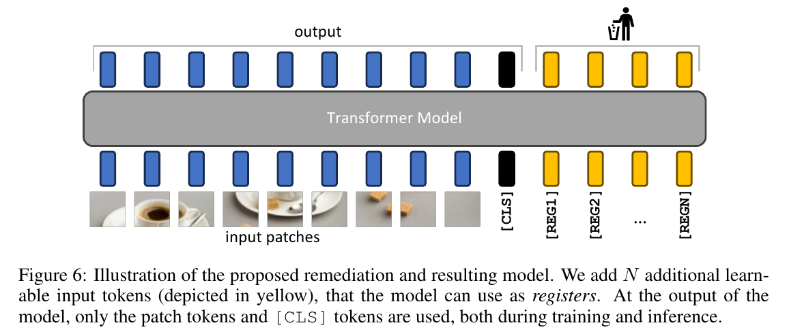
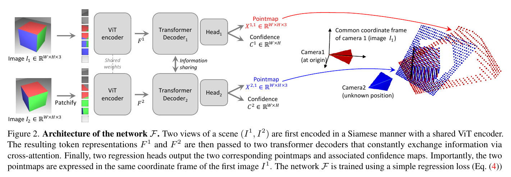
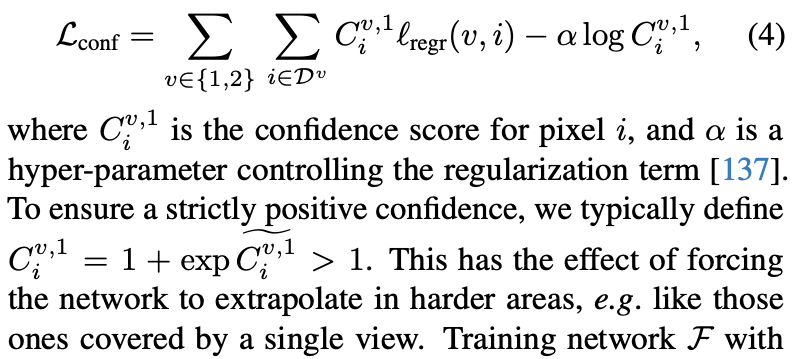
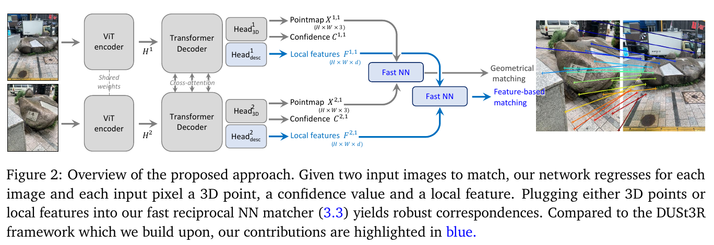
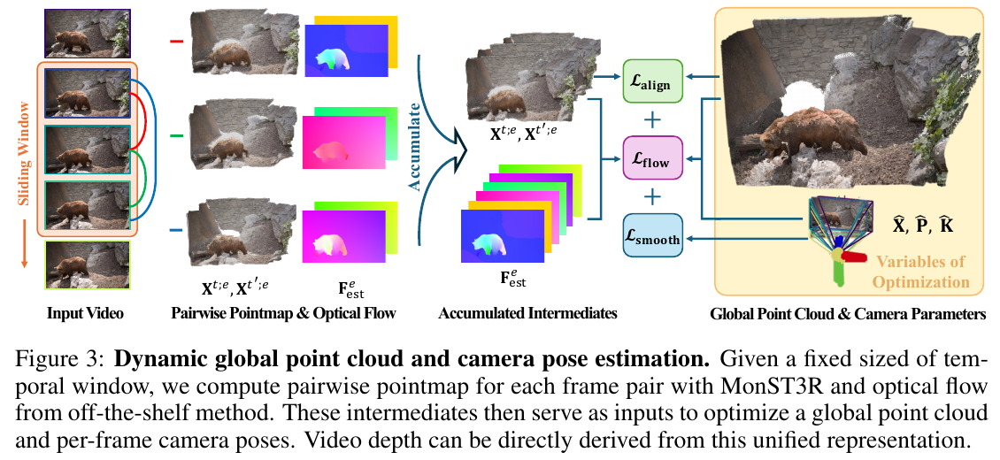
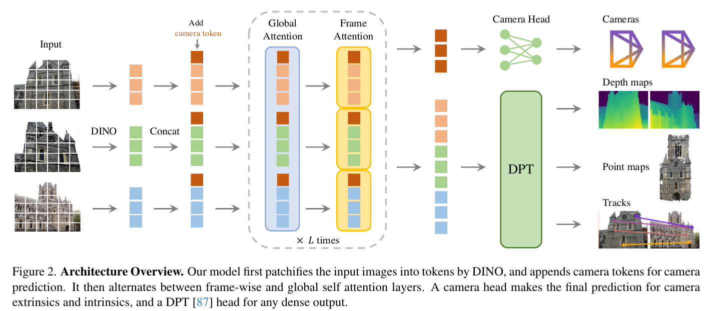
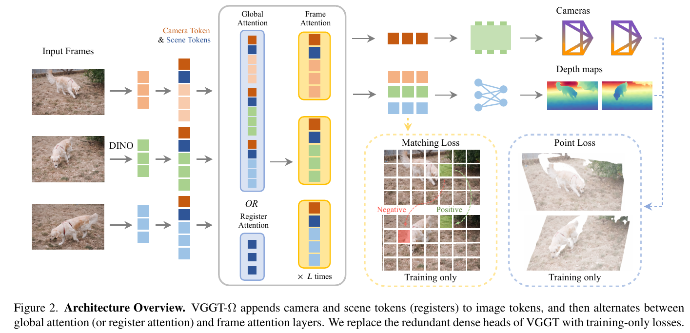

# 3D Vision Paper Notes

Papers covered, in chronological order:
1. [Vision Transformers Need Registers — ICLR24](#registers)
2. [DUSt3R: Geometric 3D Vision Made Easy — CVPR24](#dust3r)
3. [MASt3R: Grounding Image Matching in 3D with MASt3R — 2024](#mast3r)
4. [MonST3R: A Simple Approach for Estimating Geometry in the Presence of Motion — ICLR25](#monst3r)
5. [VGGT: Visual Geometry Grounded Transformer — CVPR25](#vggt)
6. [VGGT-Ω — CVPR26](#vggt-omega)

---

## 1. Vision Transformers Need Registers — ICLR24

**TL;DR**

Large ViTs spontaneously hijack a few redundant, locally-uninformative patch tokens to use as scratch space for global computation, and this shows up as high-norm attention artifacts that hurt interpretability and dense prediction. Adding a handful of dedicated, discardable "register" tokens gives the model an explicit place to do this bookkeeping instead, removing the artifacts entirely at essentially zero cost. This simple trick later becomes a core building block for multi-view 3D transformers (VGGT, VGGT-Ω), which repurpose registers as the channel for cross-frame information exchange.

**Why / What.** Modern ViTs (supervised, text-supervised, or self-supervised — except DINO) exhibit artifacts in their attention/feature maps: a small fraction of patch tokens have ~10x higher norm than normal tokens, appear in low-informative/background regions, and make attention maps noisy and uninterpretable, which in turn hurts dense prediction and unsupervised object-discovery methods. This paper diagnoses these "high-norm" tokens as a repurposing mechanism — the model hijacks redundant background patches to store and process global image information — and fixes it with a trivially simple architectural change.

**How**
- High-norm outlier tokens are identified empirically (norm > ~150, bimodal distribution) and shown to appear only in sufficiently large models (≥ViT-Large) after roughly one-third of training, concentrated around the middle layers.
- Probing experiments show outlier tokens hold *less* local information (worse position-prediction and pixel-reconstruction accuracy than normal tokens) but *more* global information (higher linear-probe image-classification accuracy), and they tend to occur on patches that are highly similar to their neighbors (i.e., locally redundant patches the model can "afford" to repurpose).
- The fix: append `N` additional learnable "register" tokens to the input sequence (after the patch embedding layer, alongside `[CLS]`), let the model use them freely as scratch space for global computation, and simply discard them at the output — only patch tokens and `[CLS]` are used downstream, both in training and inference.
- Validated across three training paradigms (DeiT-III supervised, OpenCLIP text-supervised, DINOv2 self-supervised): adding registers removes the norm outliers entirely, yields smoother/more interpretable attention maps, causes no performance regression on linear probing (classification, segmentation, depth), and improves unsupervised object discovery (LOST) at larger model scales.

    
    
<em>Figure: Register tokens are appended to the input sequence and discarded at the output; only patch and [CLS] tokens are used downstream.</em>

**Pros and Cons**:
- **Pros:** an extremely simple, architecture-agnostic fix (just add a few learnable tokens) that eliminates attention-map artifacts, improves interpretability and dense-task feature quality, and is essentially free to adopt in any ViT training recipe — this is exactly the mechanism VGGT/VGGT-Ω later repurpose as per-frame "scene" registers for multi-view 3D aggregation.
- **Cons:** the paper is empirical/diagnostic rather than theoretical — it doesn't fully explain *why* some training conditions (model size, training length, pretraining paradigm) cause artifacts to emerge, and the high-norm-token cutoff (e.g., norm > 150) is a hand-picked heuristic rather than a principled criterion.

**Key Takeaways**
- Large transformers spontaneously repurpose a handful of redundant patch tokens as ad-hoc "scratch space" for global computation, which corrupts their local/spatial information and shows up as high-norm attention artifacts.
- Giving the model dedicated, explicit registers to do this bookkeeping is enough to fully separate "global storage" from "local representation," fixing the artifact for free.
- The fix is architecture-agnostic and nearly zero-cost (a few extra learnable tokens, discarded at output), with no measured downside across supervised, text-supervised, and self-supervised training.
- This insight directly motivates later multi-view 3D transformers (VGGT, VGGT-Ω) to use per-frame "camera/scene" register tokens as the designated channel for cross-frame information exchange.

[↑ Back to TOC](#toc)

---

## 2. DUSt3R: Geometric 3D Vision Made Easy — CVPR24

**TL;DR**

DUSt3R replaces the classical, brittle SfM/MVS pipeline with a single feed-forward network that regresses dense 3D pointmaps directly from a pair of uncalibrated, unposed images. Cameras, depth, and pixel correspondences all fall out of these pointmaps post hoc, so the network never has to explicitly solve for camera parameters, and a learned confidence map flags genuinely ambiguous regions for free. For scenes with more than two images, a fast direct-3D-space global alignment step stitches all pairwise pointmaps into one consistent frame, standing in for traditional bundle adjustment.

**Why / What.** Classical 3D reconstruction (SfM + MVS) requires known/estimated camera intrinsics and extrinsics before dense geometry can be triangulated, and the multi-stage pipeline (matching → pose → triangulation → BA) is brittle and error-propagating. DUSt3R reframes pairwise 3D reconstruction as direct regression from two uncalibrated, unposed images to a dense pointmap, from which cameras, depth, correspondences, and full 3D reconstruction can all be recovered without ever explicitly solving for camera parameters.

**How**
- Two input images are encoded by a shared-weight ViT (Siamese encoder), then processed by two transformer decoders that continuously exchange information via cross-attention so each branch can reason about the other view's geometry.
- Two regression heads output a dense pointmap and confidence map per view, both expressed in the coordinate frame of the *first* image, trained end-to-end with a simple confidence-weighted 3D regression loss (no explicit geometric constraints).
- For scenes with more than two images, a fast global alignment step optimizes per-pair rigid transforms and scale factors to stitch all pairwise pointmaps into one consistent coordinate frame, replacing classical bundle adjustment with direct 3D-space optimization (much faster, converges in a few hundred gradient steps).

    
    
<em>Figure: DUSt3R architecture.</em>

**Pros and Cons**:
- **Pros:** removes the need for known/calibrated cameras entirely, gracefully degrades to monocular depth when only one view is informative, and the learned confidence map gives a built-in signal for which regions to trust, all from a single feed-forward pass. 
- **Cons:** the model is fundamentally pairwise, so scenes with more than two images need a separate, slower global alignment optimization step to merge pointmaps into one frame, and reconstruction quality/scale consistency degrades for image pairs with little visual overlap or large viewpoint gaps.

**Key Takeaways**
- Pointmaps (per-pixel 3D points in a shared reference frame) are a richer, more general output representation than depth maps or explicit camera parameters: cameras, depth, and correspondences can all be derived from them post hoc.
- Replacing the classical SfM/MVS pipeline's brittle sequential sub-problems with one end-to-end-trained regression network lets each sub-task implicitly help the others, removing the need for known intrinsics/extrinsics entirely.
- Bundle adjustment's reprojection-error minimization can be swapped for a much faster direct 3D-space alignment optimization, since the network already outputs near-consistent 3D geometry.
- A learned per-pixel confidence is an effective, supervision-free way to let the network flag genuinely ill-posed regions (single-view-only areas, sky, translucent surfaces) without hurting accuracy elsewhere.

**Q&As**
Q1: Training Loss Understanding

    
    
<em>Figure: DUSt3R confidence-aware regression loss (Eq. 4).</em>

$\mathcal{L}\_{\text{conf}}$ sums, over both views and all pixels with valid ground truth, the per-pixel regression loss $\ell\_{\text{regr}}$ scaled by a predicted confidence $C_i^{v,1}$, minus $\alpha \log C_i^{v,1}$.

The second term is the $\color{red}{\text{regularizer}}$ that keeps the confidence weighting honest. Without it, the network could trivially minimize the first term by driving every $C_i^{v,1} \to 0$, since a zero weight zeroes out any regression error regardless of how wrong the prediction is. The $-\alpha \log C$ term grows without bound as $C \to 0$ (recall $C > 1$ by construction, so $\log C > 0$ and this term is always negative, rewarding *larger* C), so pushing confidence down has a cost. The network therefore only lowers confidence on pixels where the regression error genuinely outweighs that cost, i.e., on truly ambiguous or ill-constrained regions (e.g. areas visible in only one view), while keeping confidence high (and thus the regression loss fully weighted) everywhere else. This is the same idea as heteroscedastic/aleatoric uncertainty weighting in regression: jointly learning a per-sample precision and a log-precision penalty prevents the degenerate "infinite confidence, zero loss" solution.

[↑ Back to TOC](#toc)

---

## 3. MASt3R: Grounding Image Matching in 3D with MASt3R — 2024

**TL;DR**

MASt3R augments the DUSt3R backbone with a second head that regresses dense local features under an InfoNCE matching loss, grounding 2D pixel matching in the same 3D-aware representation used for pointmap regression. A fast reciprocal nearest-neighbor matching algorithm makes dense, pixel-accurate matching tractable, cutting cost from quadratic to near-linear while actually improving accuracy via implicit outlier filtering. The result is dense, robust correspondences that remain accurate under extreme viewpoint changes, something DUSt3R's pointmaps alone could not reliably provide.

**Why / What.** Image matching is conventionally treated as a 2D pixel-correspondence problem, but matching is fundamentally a 3D problem linked to camera pose and scene geometry. DUSt3R's pointmap regression is surprisingly robust to extreme viewpoint changes but imprecise for matching since it was never trained explicitly for that task; MASt3R augments DUSt3R to deliver dense, pixel-accurate, robust correspondences.

**How**
- MASt3R keeps the DUSt3R backbone (Siamese ViT encoder + cross-attention transformer decoders) and adds a second lightweight head that regresses dense local feature maps per image, trained with an InfoNCE matching loss (a classification-style objective rewarding exact pixel correspondence, unlike the regression loss used for pointmaps).
- Exhaustive reciprocal nearest-neighbor matching over dense feature maps is O(W²H²) and too slow, so the paper introduces a fast reciprocal matching algorithm that iteratively propagates and verifies cycle-consistent matches from a sparse pixel subset, cutting cost to O(kWH) with no loss (in fact a gain) in accuracy.
- A coarse-to-fine scheme (match downscaled images first, then refine within high-resolution window crops) extends this to high-resolution images despite ViT's quadratic attention cost.

    
    
<em>Figure: MASt3R architecture.</em>

**Pros and Cons**:
- **Pros:** delivers dense, pixel-accurate correspondences directly from the DUSt3R backbone with minimal added overhead, and the fast reciprocal matching algorithm makes dense matching tractable at high resolution without sacrificing accuracy.
- **Cons:** still inherits DUSt3R's pairwise-only formulation, so it needs the same external global alignment to scale beyond two views, and adding the matching head and InfoNCE loss increases training complexity and cost relative to the base model.

**Key Takeaways**
- Matching is fundamentally a 3D problem, not a 2D one: pixel correspondences and relative camera pose are two sides of the same epipolar-geometry coin, so grounding matching in a 3D-aware backbone (DUSt3R) is a natural fit.
- Regression losses (DUSt3R's pointmap loss) and classification-style losses (InfoNCE) optimize for different things, accuracy of a continuous estimate versus exact discrete correspondence, so a dedicated matching head/loss is needed even on top of an already-3D-aware backbone.
- Dense matching's quadratic NN-search cost can be cut to near-linear with an iterative reciprocal-matching scheme that exploits cycle consistency, and that subsampling can simultaneously act as outlier filtering, improving rather than hurting accuracy.
- Coarse-to-fine matching (downscale-then-refine via window crops) is a generally reusable trick for applying quadratic-attention ViTs to high-resolution images without retraining at high resolution.

[↑ Back to TOC](#toc)

---

## 4. MonST3R: A Simple Approach for Estimating Geometry in the Presence of Motion — ICLR25

**TL;DR**

MonST3R extends DUSt3R to dynamic videos by predicting a separate pointmap per timestep in a shared coordinate frame, letting moving objects simply occupy different 3D locations across frames, with only lightweight fine-tuning of the decoder/heads on a small dynamic-scene dataset mixture. Per-frame camera pose is recovered via single-view PnP+RANSAC instead of DUSt3R's two-view alignment, and a flow-consistency check distinguishes static from dynamic regions without ground-truth motion labels. A sliding temporal window of pairwise estimates, jointly optimized with trajectory-smoothness and flow-consistency losses, replaces DUSt3R's expensive all-pairs global alignment and yields camera poses, depth, and a dynamic point cloud for full videos.

**Why / What.** DUSt3R's pointmap regression works well for static scenes, but on dynamic videos it fails in two ways: it tends to align pointmaps using the moving foreground object (misaligning the static background), and it sometimes places moving foreground objects at the wrong depth, since its training data contains only static scenes. MonST3R adapts DUSt3R to estimate per-timestep geometry directly for dynamic scenes, producing a time-varying dynamic point cloud, per-frame camera pose/intrinsics, and a dynamic/static segmentation mask, all without an explicit motion representation.

**How**
- Keeps the DUSt3R architecture and weights unchanged (Siamese ViT encoder + cross-attention decoders + pointmap/confidence heads); the key conceptual shift is to predict a separate pointmap per timestep $\mathbf{X}^t$, still expressed in a shared camera coordinate frame, so moving objects simply appear at different 3D locations across frames.
- Fine-tunes only the decoder and DPT heads (encoder frozen) on a small mixture of synthetic + real dynamic-scene datasets with ground-truth pose/depth (PointOdyssey, TartanAir, Spring, Waymo), using temporal-stride sampling (1–9 frames apart) and field-of-view augmentation to maximize data efficiency from limited dynamic training data.
- Recovers camera intrinsics/pose per frame by solving PnP+RANSAC over 2D-3D correspondences within a single view's own pointmap (rather than DUSt3R's two-view epipolar/Procrustes alignment, which dynamic objects would violate).
- Infers a "confident static" mask per frame pair by comparing optical flow predicted by an off-the-shelf flow model against the flow implied purely by camera motion on the estimated pointmap; large disagreement flags dynamic/unreliable regions.
- For full videos, avoids DUSt3R's expensive all-pairs connectivity graph by using a sliding temporal window of pairwise pointmaps + optical flow, then jointly optimizes a global point cloud and per-frame camera poses with DUSt3R's pairwise alignment loss plus two new video-specific terms: a camera-trajectory smoothness loss and a flow-projection consistency loss (enforced only on confidently static regions).
- Video depth falls out for free, since the optimized global representation is parameterized directly by camera pose and per-frame depth maps.

    
    
<em>Figure: MonST3R's sliding-window pairwise pointmap/flow estimation feeding a global optimization over point cloud and camera parameters.</em>

**Pros and Cons**:
- **Pros:** adapts an already-pretrained static-scene model to dynamic scenes with only lightweight fine-tuning on a small dataset mixture, runs largely feed-forward (fast: ~30s inference for a 60-frame video), and is competitive with or better than specialized video-depth/pose methods, including ones requiring heavy test-time optimization.
- **Cons:** still relies on an off-the-shelf optical flow model and a fairly involved global optimization (alignment + smoothness + flow losses) rather than being purely feed-forward end-to-end, and the static/dynamic mask is a thresholded heuristic that must be bootstrapped and iteratively updated during optimization.

**Key Takeaways**
- A model trained only on static scenes can fail on dynamic ones in subtle, systematic ways (aligning to the wrong moving object, mis-placing dynamic foreground depth) that stem purely from training-data distribution, not architecture, so this is fixable by targeted fine-tuning instead of redesign.
- Treating a dynamic scene as a sequence of per-timestep pointmaps in a shared coordinate frame is a minimal, elegant generalization of the static two-view pointmap representation, with moving objects naturally appearing at different 3D locations over time.
- Cross-checking optical flow predicted from estimated geometry against an independent off-the-shelf flow estimate is an effective self-consistency signal for distinguishing static from dynamic regions, without any ground-truth motion segmentation labels.
- Global, all-pairs optimization (as in DUSt3R) doesn't scale to video; a $\color{red}{\text{sliding}}$ $\color{red}{\text{temporal}}$ $\color{red}{\text{window}}$ over pairwise estimates is a practical, much cheaper substitute that still allows injecting video-specific priors (trajectory smoothness, flow consistency).

[↑ Back to TOC](#toc)

---

## 5. VGGT: Visual Geometry Grounded Transformer — CVPR25

**TL;DR**

VGGT drops the pairwise formulation entirely: a plain large transformer with alternating frame-wise and global self-attention directly predicts cameras, depth, point maps, and point tracks for one to hundreds of images in a single feed-forward pass. Multi-task supervision over these redundant, derivable quantities acts as a strong regularizer, boosting accuracy on every individual task rather than diluting it. The result outperforms optimization-heavy SfM/MVS pipelines even without post-processing, though predictions can optionally be refined with classic Bundle Adjustment for extra accuracy.

**Why / What.** DUSt3R/MASt3R-style models only process image pairs and need post-hoc global alignment/optimization to scale to many views, which is costly. VGGT asks whether a single feed-forward network—essentially a plain large transformer with minimal 3D-specific inductive bias—can directly predict *all* key 3D attributes (camera parameters, depth maps, point maps, point tracks) for one to hundreds of images in a single forward pass, outperforming optimization-heavy alternatives even without any post-processing.

**How**
- Each image is patchified into tokens via a frozen-ish DINO backbone; a learnable camera token and register tokens are appended per frame.
- These tokens pass through L=24 alternating-attention (AA) blocks that interleave frame-wise self-attention (within each image) and global self-attention (across all frames), avoiding any cross-attention.
- A lightweight camera head (self-attention + linear layers) decodes camera tokens into intrinsics/extrinsics, while a shared DPT head decodes dense image tokens into depth maps, point maps, and tracking features (the latter feeding a CoTracker2-based tracking module).
- Trained end-to-end with a multi-task loss (camera + depth + point-map + tracking losses); ablations show this redundant multi-task supervision and the AA design both meaningfully boost accuracy versus single-task or cross-attention/global-only variants.
- Predictions can optionally be refined with classic Bundle Adjustment for extra accuracy at modest extra cost.

    
    
<em>Figure: VGGT architecture.</em>

**Pros and Cons**:
- **Pros:** a single feed-forward pass handles anywhere from one to hundreds of images with no post-hoc optimization required, and the multi-task supervision (camera, depth, point map, tracking) acts as a strong regularizer that improves each individual task.
- **Cons:** the alternating-attention design over all frames scales in memory/compute with the number of views, and matching the very best accuracy still benefits from an optional, more expensive Bundle Adjustment refinement step.

**Key Takeaways**
- A plain large transformer with almost no 3D-specific inductive bias, just alternating frame-wise and global self-attention, can outperform optimization-heavy SfM/MVS pipelines in a single feed-forward pass, given enough 3D-annotated training data.
- Multi-task supervision over redundant, derivable quantities (camera, depth, point map, tracks) is not wasteful: it acts as a strong regularizer and measurably improves accuracy on every individual task versus training on a subset.
- Decomposing a complex output (point maps) into simpler, independently-supervised components (depth + camera) and recombining them at inference can beat predicting the complex output directly, even though both are jointly trained.
- Feed-forward predictions are accurate enough to serve as a strong initializer for classical Bundle Adjustment, eliminating the need for triangulation/iterative refinement and making BA-refined results both faster and more accurate than traditional pipelines.

[↑ Back to TOC](#toc)

---

## 6. VGGT-Ω — CVPR26

**TL;DR**

VGGT-Ω pushes VGGT's feed-forward formula to much larger scale (0.2B to 10B parameters, thousands to millions of training sequences), showing reconstruction accuracy improves with a consistent power-law trend much like LLMs and other foundation models. Register attention restricts cross-frame communication in a quarter of the global-attention layers to a small set of registers, cutting memory/FLOPs substantially with no measured accuracy loss, and these registers turn out to encode reusable global scene information useful beyond reconstruction. A simplified architecture (single depth + camera heads instead of four task-specific heads) and a new large-scale mined-and-filtered video annotation pipeline together extend coverage to dynamic scenes while reducing training cost relative to VGGT.

**Why / What.** VGGT-Ω studies whether feed-forward reconstruction models scale predictably with model and data size (like LLMs/vision foundation models), and whether this scaling can be pushed further while also extending coverage to dynamic (non-rigid) scenes and reducing training cost — VGGT-Ω shows a consistent power-law-like improvement in reconstruction accuracy from 0.2B→10B parameters and thousands→millions of training sequences.

**How**
- Keeps VGGT's per-frame camera/scene "register" tokens but introduces **register attention**: in 25% of the global-attention layers, cross-frame information exchange is restricted to just the registers (rather than all tokens), which then redistribute information back into per-frame tokens during frame-wise attention — this cuts memory/FLOPs substantially (registers act as an information bottleneck) with no measurable performance loss.
- The trained registers turn out to carry reusable global scene information, useful for VLA/language-alignment tasks beyond reconstruction.
- The architecture is simplified by dropping point-map and tracking heads in favor of a single dense depth head plus a sparse camera head (multi-task *losses* are kept, multi-task *heads* are not).
- Memory-hungry high-resolution DPT convolutional layers are replaced with a lightweight MLP + pixel-shuffle upsampler.
- Training scale is enabled by a new annotation pipeline (VLM pre-filtering + VGGT + COLMAP + image matchers + geometric post-filtering) that mines ~40M internet videos down to 0.8M accurately annotated sequences (including dynamic content).
- A DINO-style self-supervised teacher-student protocol additionally exploits 18M unlabeled videos.

    
    
<em>Figure: VGGT-Ω architecture.</em>

**Pros and Cons**:
- **Pros:** register attention cuts memory/FLOPs substantially with no measurable accuracy loss, the model scales predictably (power-law-like) with parameters and data, and it extends coverage to dynamic scenes while also being cheaper to train than VGGT.
- **Cons:** dropping the point-map and tracking heads trades off some task-specific outputs for efficiency, and the gains depend heavily on the new large-scale mined annotation pipeline, which adds significant data-engineering complexity outside the model itself.

**Q&As**  
Q1: As for Dynamic Reconstruction, what special techniques they used?

VGGT-Ω's main trick is a **representation choice rather than a dedicated motion module**:
- **Drop point maps; predict only depth + camera per frame.** Point maps (used by VGGT, DUSt3R, MonST3R) bake camera motion and scene motion together into one 3D field, fine for static scenes, but for dynamic scenes this then requires segmenting out moving pixels (MonST3R's approach) or extending to "dynamic point maps." VGGT-Ω avoids the coupling entirely: independent per-frame depth + camera parameters mean a moving object's depth is just camera-relative depth, with no global rigid point-cloud consistency required.
- **Avoid ray maps too**, since they add an expensive dense output and can entangle camera information with pixel-wise appearance changes (e.g., a stationary camera filming a dancer has large *scene* motion but fixed *camera* parameters, which ray maps would conflate).
- **No explicit motion masks/outputs.** The model predicts nothing that requires labeling "what is moving," letting the data-driven prior implicitly learn this instead of hand-crafted non-rigid-SfM constraints (low-rank/local-rigidity priors used by classical methods).
- **Data engineering for dynamic supervision:** the 40M-video annotation pipeline uses Grounding DINO to detect and mask out dynamic regions (people, cars) so depth/camera annotations aren't corrupted by motion, while still keeping ~200K dynamic scenes in training (vs. 600K static).
- **Self-supervised teacher-student training** adds robustness for free: random frame reordering and patch masking during the unlabeled-video phase force invariance to frame order and appearance changes, directly helping motion generalization.
- **Emergent, not engineered, motion-awareness** (Fig. 9 in the paper): without any motion labels, optical flow, or explicit probes, PCA + k-means clustering of intermediate tokens spontaneously separates moving objects from the static background, confirming the reconstruction objective alone teaches the model to localize motion.

**Key Takeaways**
- Feed-forward 3D reconstruction models follow a power-law-like scaling trend with both model size and data size, mirroring LLM/vision-foundation-model scaling and suggesting reconstruction is a strong, scalable proxy task for general spatial understanding.
- Global attention's cost can be made sub-quadratic by routing cross-frame communication through a small set of registers (a bottleneck), since global attention maps are empirically very sparse, with no measurable accuracy loss.
- Registers are not just an efficiency trick: they end up encoding reusable, transferable global scene representations useful beyond reconstruction (e.g., VLA models, language alignment).
- Redundant prediction heads can be replaced by redundant losses on a single shared head: multi-task supervision still helps, but doesn't require dedicated output heads per task, saving substantial memory.
- Scaling training data for dynamic/internet-video content requires building automated, high-quality annotation pipelines (model-assisted filtering + geometric verification) and self-supervised teacher-student training to safely exploit unlabeled video at scale.

[↑ Back to TOC](#toc)
